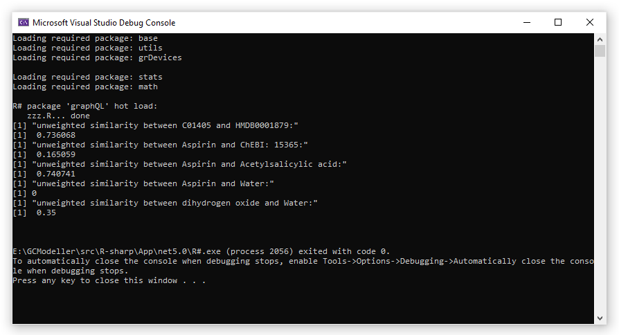

# NoSQL graph database engine writen in VisualBasic


## Code Usage

imports the ``R#`` package in script, and then create a empty graph database:

```py
import graphQL

kb = MsgFile::open()
```

then you can insert the knowledge data into the database engine:

```py
# example of insert the knowledge data in table format liked:
#              key                             value
# ---------------------------------------------------
# <mode>  <string>                          <string>
# [1, ]       "id"                          "C01405"
# [2, ]     "name"                         "Aspirin"
# [3, ]     "name"            "Acetylsalicylic acid"
# [4, ]     "name" "2-Acetoxybenzenecarboxylic acid"
# [5, ]     "name"                "Acetylsalicylate"
# [6, ]  "formula"                          "C9H8O4"

#  [ reached 'max' / getOption("max.print") -- omitted 7 rows ]

def process_knowledge(kb, data):
    data = as.list(data, byrow = True)
    data = groupBy(data, x -> x[["key"]])
    data = lapply(data, x -> sapply(x, i -> i[["value"]]), x -> x[["key"]])
        
    Query::insert(kb, data[["id"]], data)
```

at last you can query the knowledge databse with query function, or assert that two term is identical or not?

```py
# query knowledge data by term
result = Query::query(kb, "Aspirin")
# [1]     "Aspirin is the name of C01405 with confidence 1.00"
# [2]     "Aspirin is the name of HMDB0001879 with confidence 1.00"
# [3]     "Aspirin is the name of ChEBI:15365 with confidence 1.00"

# assert that two term are identical or not?

Query::similarity(kb, "Aspirin", "Acetylsalicylic acid")
# [1]  0.740741

Query::similarity(kb, "Aspirin", "water")
# [1]  0

Query::similarity(kb, "dihydrogen oxide", "water")
# [1]  0.35
```

